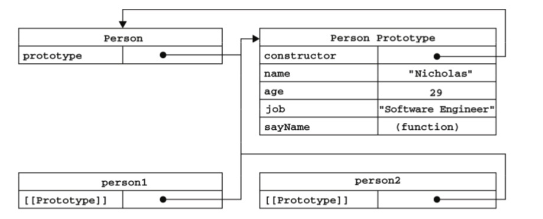
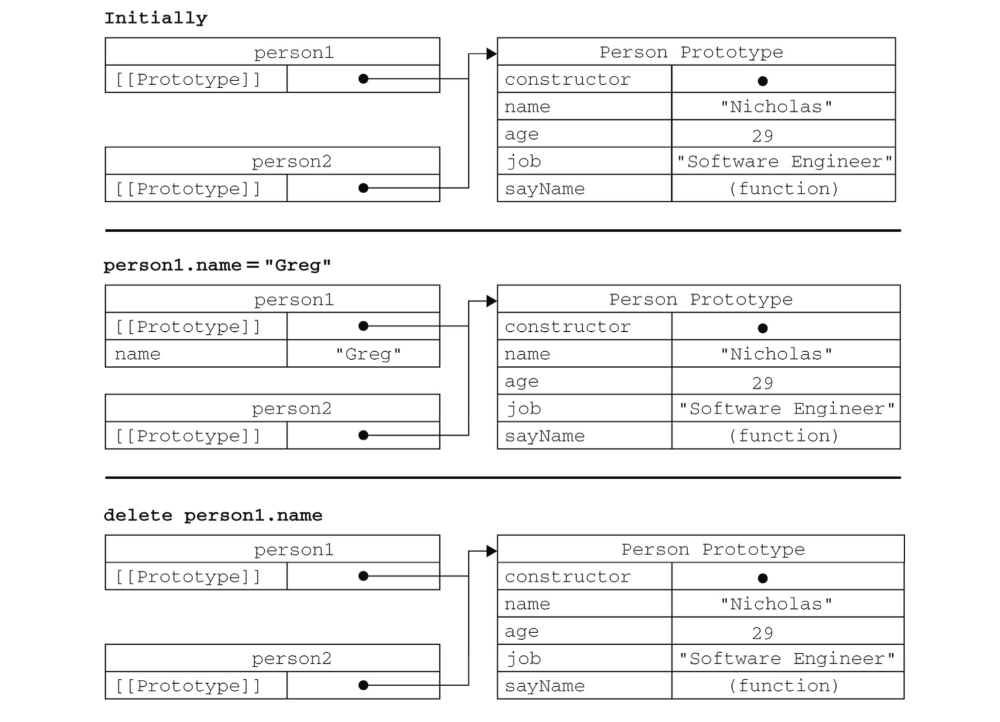
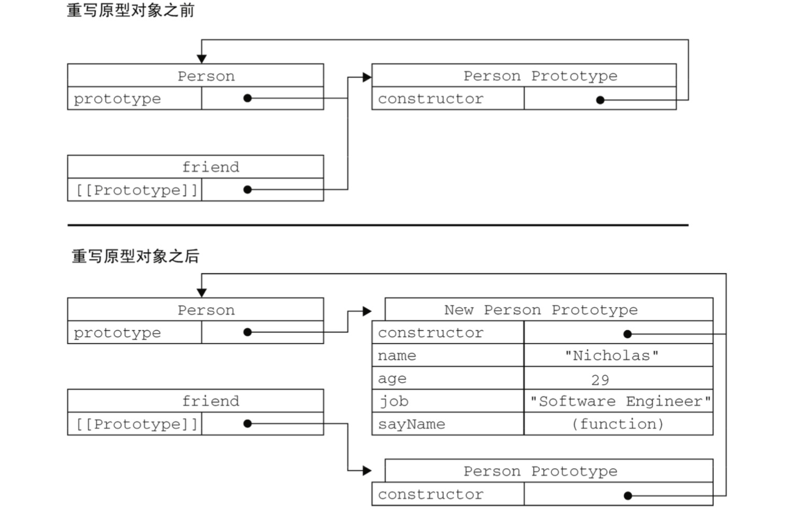

### 原型模式
我们创建的每个函数都有一个prototype属性，这个属性是个指针，指向一个对象。
而这个对象的用途是包含可以有特定类型的所有实例共享的属性和方法。
```js
function Person() {}
Person.prototype.name = 'Liu'
Person.prototype.age = 30
Person.prototype.job = '程序员'
Person.prototype.sayName = function() {
  alert(this.name)
}

let person1 = new Person()
let person2 = new Person()
console.log(person1.name) // Liu
console.log(person2.name) // Liu
console.log(person1.sayName === person2.sayName) // true
```

#### 理解原型
每个函数都会有一个prototype属性，该属性指向原型对象。在默认情况下，原型对象都会自动获得一个constructor属性，
该属性指向包含一个指向prototype属性所在函数的指针。

看下图：
```js
function Person() {}
Person.prototype.name = 'Liu'
Person.prototype.age = 30
Person.prototype.job = '程序员'
Person.prototype.sayName = function() {
  alert(this.name)
}

let person1 = new Person()
person1.name = 'xing'
let person2 = new Person()

console.log(Person.prototype) // Person.prototype
console.log(Person.prototype.constructor) // Person
console.log(person1.__proto__) // Person.prototype
console.log(person2.__proto__) // Person.prototype
```

#### isPrototypeOf 和 Object.getPrototypeOf
isPrototypeOf确定实例与原型之间是否有关系
Object.getPrototypeOf获取对象的原型
```js
alert(Person.prototype.isPrototypeOf(person1));  // true
alert(Person.prototype.isPrototypeOf(person2));  // true

alert(Object.getPrototypeOf(person1) === Person.prototype); // true 
alert(Object.getPrototypeOf(person1).name); // "xx"
```

#### 搜索
对象读取属性，每次都是执行一次搜索。先查找实例上面有没有该属性，若有则直接返回，
若没有再查找原型上面有没有，若有则直接返回。若没有则返回undefined

可以通过对象实例访问保存在原型中的值，但是不能通过实例重写原型中的值。
如果实例中存在同名属性，则会屏蔽原型中的属性。

通过delete删除实例中的属性，则又会搜索到原型
hasOwnProperty可以检测属性是存在实例中还是原型中

```js
function Person(){
}
Person.prototype.name = "Nicholas";
Person.prototype.age = 29;
Person.prototype.job = "Software Engineer";
Person.prototype.sayName = function(){
  alert(this.name);
};
  
var person1 = new Person();
var person2 = new Person();
alert(person1.hasOwnProperty("name"));  //false
person1.name = "Greg";
alert(person1.name); // "Greg 
alert(person1.hasOwnProperty("name")); //true
alert(person2.name); //"Nicholas
alert(person2.hasOwnProperty("name")); //false
delete person1.name;
alert(person1.name); //"Nicholas"
alert(person1.hasOwnProperty("name")); //false
```
看下图：


##### 􏿤􏿥􏿍􏶶􏳉􏳊􏿦􏻲􏿤􏿥􏿍􏶶􏳉􏳊􏿦􏻲更简单的原型语法
```js
function Person(){
}
Person.prototype = {
    name : "Nicholas",
    age : 29,
    job: "Software Engineer",
    sayName : function () {
        alert(this.name);
    }
};
```
可以通过对象字面量的方式创建属性和方法，相当于重新设置了一个新的对象。
不过其中的constructor就不在指向Person了，而是指向了Object，所以如果constructor值很重要，可以重新constructor的值。
```js
function Person(){
}
Person.prototype = {
    constructor: Person,
    name : "Nicholas",
    age : 29,
    job: "Software Engineer",
    sayName : function () {
        alert(this.name);
    }
};
```
按照上面的设置，此时constructor 又重新指向了Person，但是此时又会有一个问题，constructor变成可枚举了
所以可以按照下面的方式设置
```js
function Person(){
}
Person.prototype = {
    name : "Nicholas",
    age : 29,
    job: "Software Engineer",
    sayName : function () {
        alert(this.name);
    }
};

Object.defineProperty(Person.prototype, 'constructor', {
  enumerable: false,
  value: Person
})
```
##### 原型的动态性
看个例子
```js
let person1 = new Person()

Person.prototype.sayHello = function() {
  alert('hello')
}

person1.sayHello() // hello
```
像上面这样，先创建实例，然后在原型上面添加sayHello方法，此时调用实例的sayHello仍可以找到。
原因在于实例和原型之间的松散连接关系，它们之间的连接不过是一个指针，而不是副本。
在调用person1.sayHello的时候，也是一次搜索的过程，先去查找实例上面有没有sayHello，没有，然后再去查找原型
然而如果通过对象字面量的方式重写原型，那么就有问题了
```js
function Person(){
}
var friend = new Person();
Person.prototype = {
    constructor: Person,
    name : "Nicholas",
    age : 29,
    job : "Software Engineer",
    sayName : function () {
        alert(this.name);
    }
};
friend.sayName();   //error
```
原因在于切断了构造函数与最初原型之间的关系了，


##### 原型对象的问题
因为原型对象上面的属性和方法都被所有的实例所共享，那么如果属性是引用类型的话，那么就存在问题了
```js
function Person(){
}
Person.prototype = {
    constructor: Person,
    name : "Nicholas",
    age : 29,
    job : "Software Engineer",
    friends : ["Shelby", "Court"],
    sayName : function () {
        alert(this.name);
} };
var person1 = new Person();
var person2 = new Person();
person1.friends.push("Van");
alert(person1.friends);    //"Shelby,Court,Van"
alert(person2.friends);    //"Shelby,Court,Van"
alert(person1.friends === person2.friends);  //true
```
